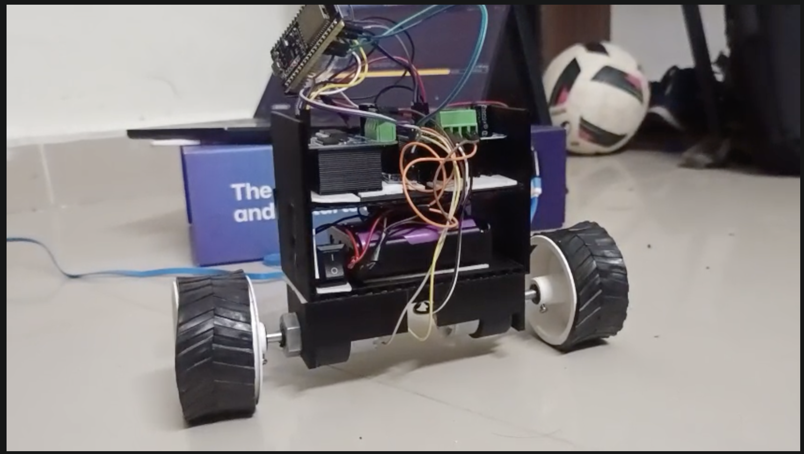
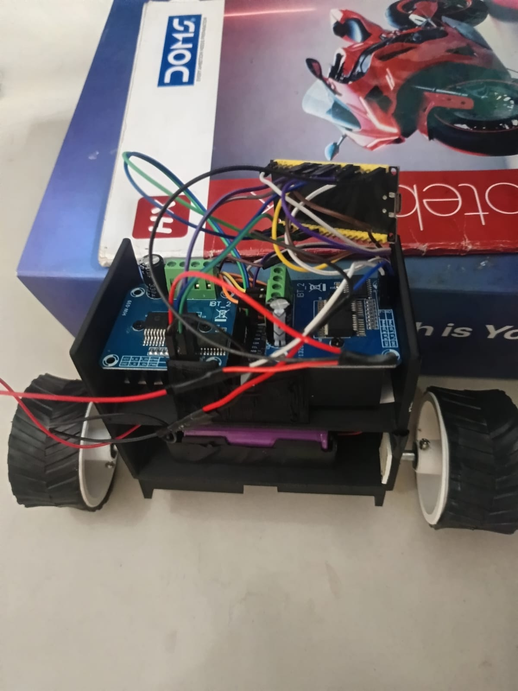
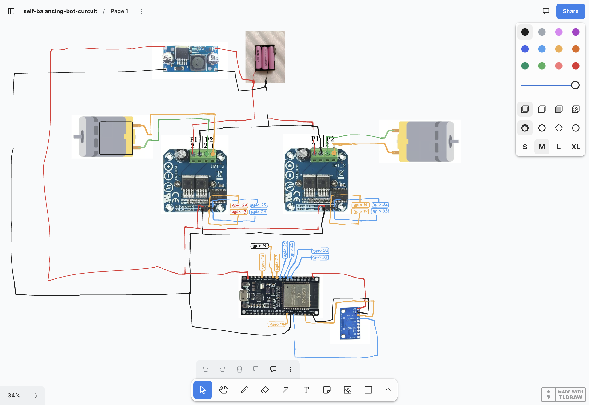
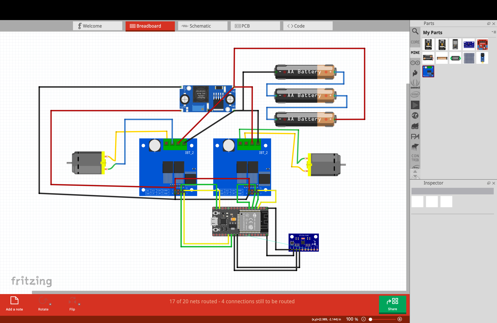
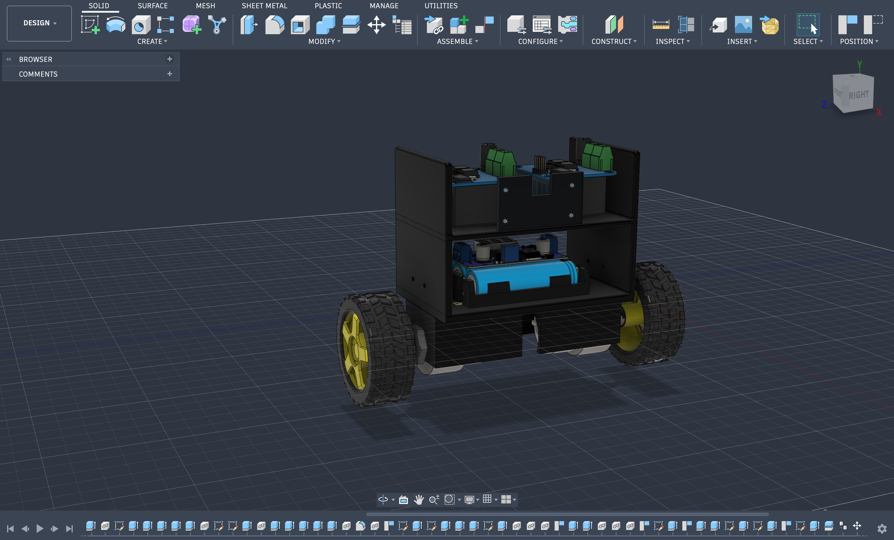

# Self Balancing Robot 

This is a built two-wheeled robot which balances itself using an ESP32 and MPU-9250 IMU sensor and two IBT-2 motor drivers



## What is it?

It is a two-wheeled robot that stays upright by sensing its tilt with the IMU and adjusting motor speed accordingly. The ESP32 reads data about acceleration and angular velocity from the IMU. It then calculates how much the robot is tilting using a filter. Based on this angle it controls both DC motors to keep the robot balanced

The self-balancing robot works like a pendulum:

```text

Robot tilts → IMU senses changes → ESP32 calculates angle

→ PID calculates control → Motor controls → Robot balanced

```



## Why I built it?

I wanted to build a project that combines design, electronics, sensors, motor control and programming. Self-balancing robots are interesting because both the physical structure and the software code directly affect how well the robot performs.

## Hardware

| Component                    |   Quantity |
| ---------------------------- | ----: |
| ESP32 DOIT DevKit V1         |     1 |
| GY-9250 / MPU-9250 IMU       |     1 |
| BTS7960 / IBT-2 Motor Driver |     2 |
| 12V DC Gear Motor            |     2 |
| Wheels                       |     2 |
| 18650 Li-ion Battery         |     3 |
| 12V → 5V Buck Converter      |     1 |
| Custom 3D-Printed Chassis    |     1 |
| Wiring and Connectors        | 1 set |


## Wiring




## Cad



### MPU-9250 → ESP32

| MPU-9250 | ESP32   |
| -------- | ------- |
| VCC      | 3.3V    |
| GND      | GND     |
| SDA      | GPIO 21 |
| SCL      | GPIO 22 |

The MPU-9250 communicates via I²C at address `0x68`.


### Motor Driver #1 → ESP32

| IBT-2 Pin | ESP32   |
| --------- | ------- |
| RPWM      | GPIO 25 |
| LPWM      | GPIO 26 |
| R_EN      | GPIO 27 |
| L_EN      | GPIO 13 |
| GND       | GND     |
| VCC       | 5V      |

Motor 1 connects to `M+` and `M-`.

### Motor Driver #2 → ESP32

| IBT-2 Pin | ESP32   |
| --------- | ------- |
| RPWM      | GPIO 32 |
| LPWM      | GPIO 33 |
| R_EN      | GPIO 14 |
| L_EN      | GPIO 19 |
| GND       | GND     |
| VCC       | 5V      |

Motor 2 connects to `M+` and `M-`.


## Power

The 12V battery powers the motor drivers directly:

```text

Battery + → IBT-2 #1 B+

→ IBT-2 #2 B+

→ Buck IN+

Battery. → IBT-2 #1 B-

→ IBT-2 #2 B-

→ Buck IN-

```

The buck converter provides 5V:

```text

Buck 5V → ESP32 5V/VIN

→ IBT-2 #1 VCC

→ IBT-2 #2 VCC

```

All grounds must be connected together:

```text

Battery. + Buck GND + ESP32 GND. Both IBT-2 GND

```

## Firmware

The firmware is located at:

```text

firmware/main.cpp

```

It does the following:

Reads the MPU-9250 over I²C

Calibrates the gyroscope

Computes the robots tilt angle

Applies a complementary filter

Uses a PID control algorithm

Controls both motors

Stops motors if the robot tilts beyond an angle

The code is compiled for:

```text

DOIT ESP32 DEVKIT V1

```

Open the monitor at 115200 baud. When starting hold the robot steady so the IMU can calibrate properly.

## PID

The robot compares its angle to a target angle and uses PID control to fix any error:

```text

PID = (Kp × Error). Ki × Integral) + (Kd × Derivative)

```

Actual values used:

```cpp

targetAngle = 3.46;

Kp = 10.0;

Ki = 0.0;

Kd = 0.5;

```

These values may change depending on versions of the robot.

## CAD

The CAD files are in:

```text

cad/self balancing.f3z

cad/self balancing.step

```

The CAD model shows the mechanical design of the robot.

## Videos

### Working

[`video/working/video-w-1.mp4`](video/working/video-w-1.mp4)

### Testing

[`video/testing/video-f-1.mp4`](video/testing/video-f-1.mp4)

[`video/testing/video-f-2.mp4`](video/testing/video-f-2.mp4)

## Bill of Materials

A full BOM is in:

[`bom.csv`](bom.csv)


##  Components

| Components                   | Quantity | Purchase Link                                                                                                                                                                                                                                                                   |
| ---------------------------- | -------- | ------------------------------------------------------------------------------------------------------------------------------------------------------------------------------------------------------------------------------------------------------------------------------- |
| ESP32 DOIT DevKit V1         | 1        | [Robu.in Link](https://robu.in/product/wroom-32-esp32-wifi-bt-ble-mcu-module/)                                                                                                                                                                                                  |
| GY-9250 / MPU-9250           | 1        | [Robokits Link](https://robokits.co.in/sensors/gyroscope-and-inertial-imu/9dof-3-axis-accelerometer-gyroscope-magnetometer-gy-9250?srsltid=AfmBOopiH0Up3o8P3-oHTvJcObh-OI1lNOijdAXyQr8ByRqUDNTo8jB7DdQ)                                                                         |
| BTS7960 / IBT-2 Motor Driver | 2        | [Robu.in Link](https://robu.in/product/bts7960-43a-h-bridge-high-power-stepper-motor-driver-module/)                                                                                                                                                                            |
| 12V DC Gear Motor            | 2        | [Robocraze Link](https://robocraze.com/products/200-geared-motor?variant=40192492601497&country=IN&currency=INR&utm_medium=product_sync&utm_source=google&utm_content=sag_organic&utm_campaign=sag_organic&srsltid=AfmBOopKAbyO-XIRKLJx-OmosgXKJial2h5KzaEtUzNf0ObJwdZQ6by-A0U) |
| Wheels                       | 2        | [Robomart Link](https://robomart.com/product/5x2-wheel-robotic-tyre-for-robotics-diy-for-dc-gear-motor-5x2-cm/?srsltid=AfmBOoqEX9lZ8_wr8UwCeNvzkUKPLWCdvC01yqPme6XPvA1c9YBfUza4lSY)                                                                                             |
| 18650 Li-ion Battery         | 3        | [Electronicspices Link](https://electronicspices.com/product/18650-2600mah-3-65v-lithium-ion-cell?srsltid=AfmBOorxf52YEWnK8CLL8YlFW5W6aVtw5Zjrw4-55JQey9dv0Gju4ACj2Q8)                                                                                                          |
| 12V → 5V Buck Converter      | 1        | [RajivElectronics Link](https://rajivelectronics.com/product/lm2596-dc-dc-buck-converter-adjustable-step-down-module?srsltid=AfmBOoryoWfYvhn5YVpWpyPrIyInsibDxFsjgWKL2nmv9f-ZqJS0QHG6Jwc)                                                                                       |
| 3D Printed Chassis           | 1        | Custom design included in the [`cad`](cad/) folder                                                                                                                                                                                                                              |
